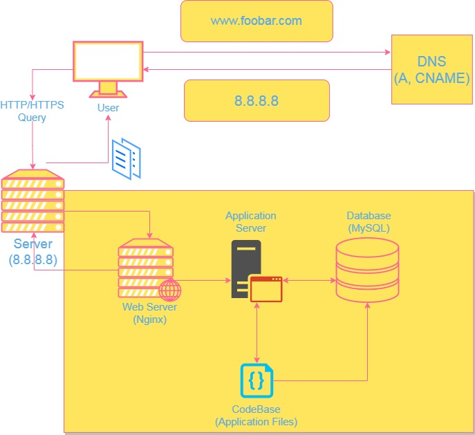

# Simple web stack
---

## Components of this web infrastructure
### What is a server?
A server is a physical or virtual machine usually located at a data center that hosts and serves your website. In this case, it's the computer running on a Linux operating system handling all the tasks.
### What is the role of the domain name?
A domain name provides a human-readable address for your website since computers only communicate using numbers which is hard for us humans to remember.
It is then translated by DNS to the server's IP address (8.8.8.8 in this case)
### What type of DNS record is www in www.foobar.com?
www is a subdomain handled by the CNAME record specifying that www.foobar.com points to the server's domain name which itself resolves to the server's IP address (8.8.8.8)
### What is the role of the web server?
The web server handles HTTP/HTTPS requests from the user's browsers, forwards dynamic requests to the application server, and then serves static web pages directly back to the user.
### What is the role of an application server?
The application server receives dynamic requests from the web server. Here your code base starts processing the requests, generates dynamic content, and sends it back to the web server.
### What is a database?
A database is used to store and manage your website's data by interacting with the application server, which queries and updates data as needed to realize a stateful web experience.
## The issues with this web infrastructure
### SPOF (Single point of failure)
If the server goes down, the entire website becomes inaccessible. To address this, you could consider redundancy, load balancing, or having a backup server.
### Downtime during maintenance
Deploying new code or performing maintenance on the web server may lead to downtime. Strategies like load balancing and having a staging environment can help minimize downtime.
### Scalability challenges
Handling a sudden increase in traffic can be challenging with a single server. Scaling options like adding more servers, load balancing, or utilizing cloud services should be considered for scalability.
